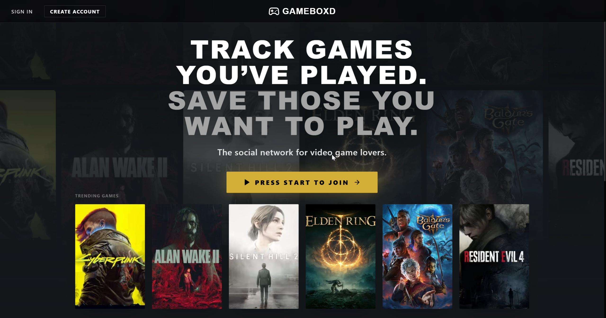
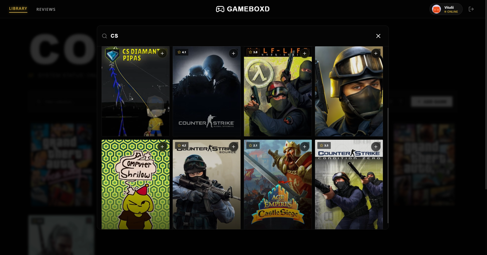
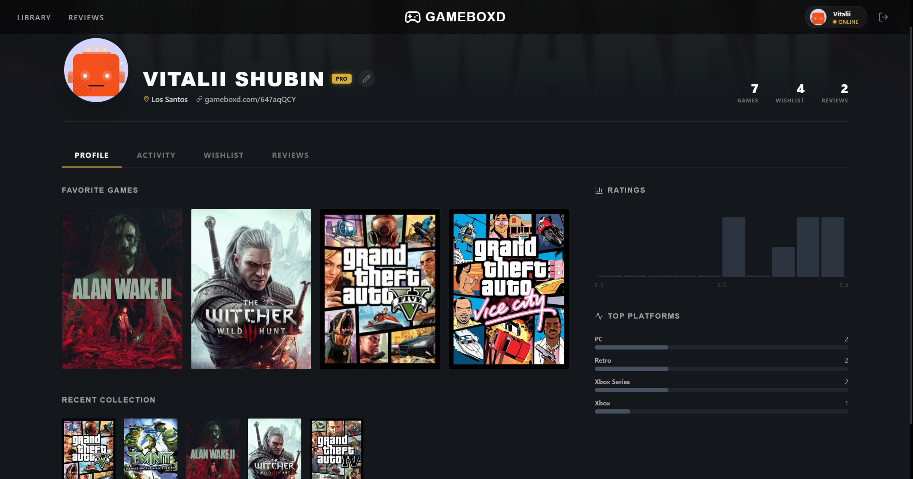

# 🎮 Gameboxd


**Gameboxd** is a modern, responsive web application for video game tracking, inspired by Letterboxd. It allows users to manage their game collection, track their backlog, rate titles, and write personal reviews.

I built this project to master the **Next.js 14 App Router** ecosystem, **TypeScript** strict typing, and **Firebase** backend integration.



---

## ✨ Key Features

* **🔍 Instant Game Search:** Integrated with the **IGDB API** (Twitch) to search through 200,000+ games with real-time results.
* **📚 Library Management:** Organize games by status: *Playing, Backlog, Completed, Dropped*.
* **⭐ Rich Interactivity:** Rate games (0-5 stars with half-star precision), log completion dates, and write reviews.
* **🔐 Secure Authentication:** Full Google & Email/Password login flows using **Firebase Auth**.
* **☁️ Cloud Sync:** User data is persisted in **Firestore**, ensuring libraries are accessible from any device.
* **📱 Fully Responsive:** Mobile-first design with a custom hamburger menu, touch-friendly inputs, and "glassmorphism" UI.

---

## 🛠 Tech Stack & Decisions

I chose a modern stack to ensure performance, scalability, and type safety.

| Category | Technology | Why I chose it |
| :--- | :--- | :--- |
| **Framework** | **Next.js 14** | For the App Router, Server Components, and API Routes to secure API keys. |
| **Language** | **TypeScript** | To prevent runtime errors and ensure strict data modeling for Game objects. |
| **Styling** | **Tailwind CSS** | For rapid UI development and consistent design tokens. |
| **Backend** | **Firebase** | For a serverless architecture (Auth + Firestore NoSQL database). |
| **Icons** | **Lucide React** | For lightweight, consistent SVG icons. |
| **Performance** | **Lighthouse** | Optimized LCP and CLS scores (AVIF images, font optimization). |

---

## 📸 App Screenshots

### The Library & Search
Manage your collection with sorting (Date, Rating) and find new games instantly.

| Library Grid | Search Modal |
| :---: | :---: |
|  |  |

### Game Details
A modal interface to manage specific game data without leaving the page.

| Game Details |
| :---: |
|  |

---

## 🧠 Challenges & Optimizations

During development, I focused heavily on **User Experience (UX)** and **Performance**:

1.  **Optimistic UI Updates:**
    Instead of waiting for the API to respond, the UI updates instantly when a user adds a game or logs out. This makes the app feel "native" and snappy.

2.  **Image Optimization:**
    I used `next/image` with AVIF format support and proper `sizes` attributes. This drastically reduced the Largest Contentful Paint (LCP) time, even on mobile networks.

3.  **IGDB API Proxy:**
    To avoid exposing secret keys in the browser, I built a Next.js API Route (`/api/search`) that acts as a proxy between the client and the Twitch/IGDB servers.

4.  **Sticky UI Elements:**
    In the Game Details modal, I implemented a sticky footer for the "Save/Delete" actions. This ensures the buttons are always accessible, even if the game description is very long.

---

## 🚀 How to Run Locally

If you'd like to test this project on your machine:

1.  **Clone the repository:**
    ```bash
    git clone [https://github.com/YOUR_USERNAME/gameboxd.git](https://github.com/YOUR_USERNAME/gameboxd.git)
    cd gameboxd
    ```

2.  **Install dependencies:**
    ```bash
    npm install
    ```

3.  **Configure Environment Variables:**
    Create a `.env.local` file in the root directory. You will need your own Firebase and Twitch Developer keys.

    ```env
    # Firebase (From Project Settings)
    NEXT_PUBLIC_FIREBASE_API_KEY=your_key
    NEXT_PUBLIC_FIREBASE_AUTH_DOMAIN=your_project.firebaseapp.com
    NEXT_PUBLIC_FIREBASE_PROJECT_ID=your_id

    # IGDB / Twitch API (From dev.twitch.tv)
    NEXT_PUBLIC_TWITCH_CLIENT_ID=your_client_id
    TWITCH_CLIENT_SECRET=your_client_secret
    ```

4.  **Run the development server:**
    ```bash
    npm run dev
    ```

Open [http://localhost:3000](http://localhost:3000) to view it in the browser.

---

## 🔮 Future Roadmap

* [ ] **Social Features:** Public profiles to share libraries with friends.
* [ ] **Advanced Filtering:** Filter library by Genre, Platform, or Release Year.
* [ ] **Data Import:** Ability to import libraries from Steam.

---

## 📝 License

This project is open source and available under the [MIT License](LICENSE).

---

<p align="center">
  Built with ❤️ by <a href="https://github.com/YOUR_USERNAME">Your Name</a>
</p>
